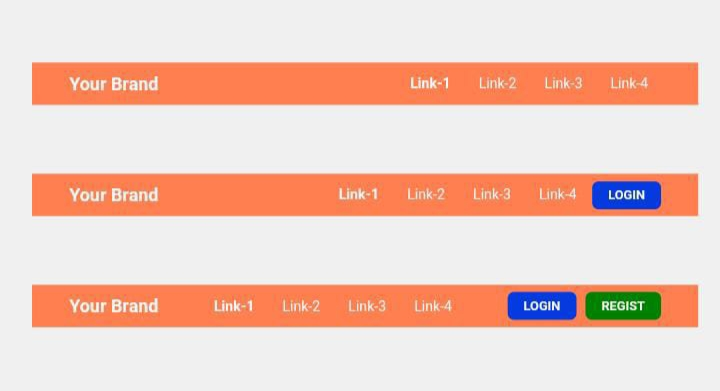

# Navigation Bar (NavBar)
Navbar adalah singkatan dari navigation bar. merupakan komponen website yang berupa menu. yang biasanya diletakkan pada header website. Komponen navbar biasanya digunakan untuk membuat menu navigasi yang terletak pada bagian header website. bisa kita sebut sebagai menu utama dari sebuah website.

Pada repo kali ini kami akan membagikan cara _**"Bagaimana cara membuat Navigasi Bar menggunakan HTML & Flexbox CSS"**_. Penasaran, bagaimana cara kami membuatnya? Skuy ikuti terus bagaimana cara kami membuatnya.

### 1. Siapkan dokumen file **HTML**
```html
<!DOCTYPE html>
<html>
  <head>
    <meta http-equiv="content-type" content="text/html; charset=utf-8" />
    <title>Navigation Bar ~ CodeXDeres</title>
  </head>
  <body>
    
  </body>
</html>
```
> Simpan file dengan nama navbar.html dan kemudian tambahkan tag `<nav></nav>` untuk membuat pembungkus daripada kumpulan menu link navigasi didalam tag `<body></body>`.

#### Buatlah bagan tag `<nav></nav>` yang sudah kami sediakan dan masukkan kedalam tag `<body></body>` kalian.
```html
<nav class="navbar">
        <div class="navbar-brand">
          <a href="#" class="a-link">
            <h1>Your Brand</h1>
          </a>
        </div>
        <div class="navbar-wrap">
          <a href="#" class="a-link navlink **active**">Link-1</a>
          <a href="#" class="a-link navlink">Link-2</a>
          <a href="#" class="a-link navlink">Link-3</a>
          <a href="#" class="a-link navlink">Link-4</a>
        </div>
      </nav>
```
> Apabila kita ingin memberikan sentuhan warna / style pada bagan **Navigation Bar** yang sudah kita rancangan diatas, kita perlu membuat stylisnya secara terpisah.

> Untuk mengkoneksikan antara file html & css, cukup menuliskan code seperti berikut ini:
> `<link rel="stylesheet" href="style.css" type="text/css" media="all">`

### 2. Buatlah file baru dengan nama style.css untuk memberikan warna agar lebih menarik untuk dilihat, perhatikan sintaks berikut ini:


```css
*{
  margin: 0;
  padding: 0;
}
.active{
  font-weight: bold;
}
.a-link{
  text-decoration: none;
}
/* Style Navbar */
.navbar{
  width: 100%;
  height: 50px;
  padding: 8px;
  display: flex;
  align-items: center;
  justify-content: space-around;
  background-color: coral;
}
.navbar .navbar-brand a h1{
  color: whitesmoke;
  font-size: 28px;
}
.navbar-wrap .navlink{
  color: whitesmoke;
  margin: 20px;
  font-size: 22px;
}
```
> Untuk membuat tampilan kita menjadi `flexbox` maka kita cukup menuliskan code `display: flex;` didalam file css. Secara default **flexbox** menampilkan hasilnya secara `row / horizontal`, jadi kalau misalkan kita ingin mengubahnya menjadi **column / vertikal** maka kita butuh menuliskan code seperti `flex-direction` didalam file css kita.

```css
.navbar{
    display: flex;
    flex-direction: column;
}
```
> **Note:** Jika kalian ingin melihat source lengkapnya silahkan check didalam file yang sudah kami sediakan di Repository ini.

Demikianlah sharing kami kali ini tentang **Cara membuat Navigation Bar dengan Flexbox**, apabila ada yang ingin kalian tanyakan & saran silahkan Join kedalam Forum Telegram [CodeXDeres Indonesia](https://t.me/codexderes).

**See you next Repo :-)**

_Salam Hangat_
**CodeXDeres Team**
